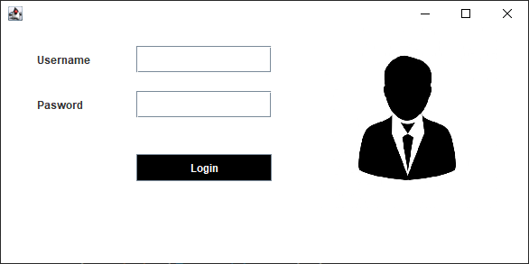
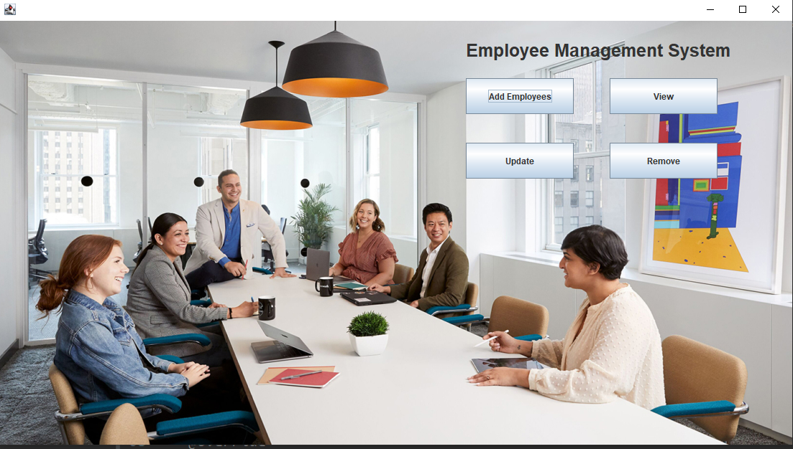
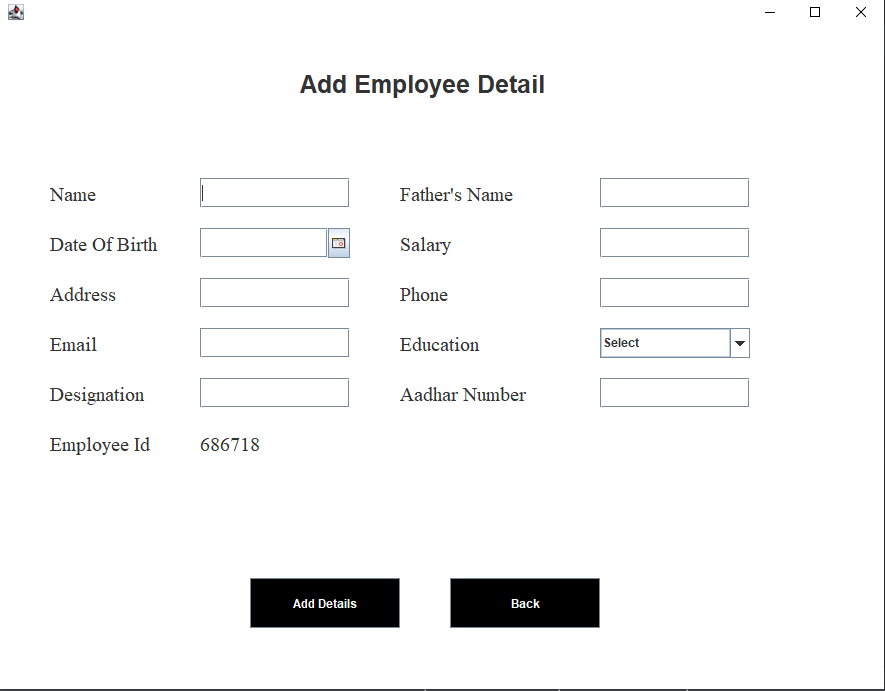
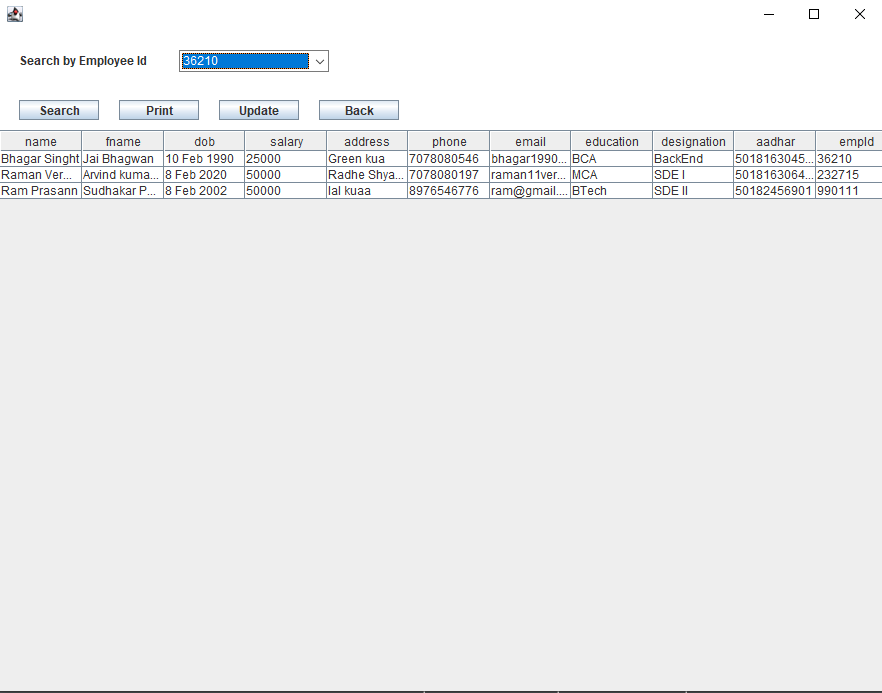
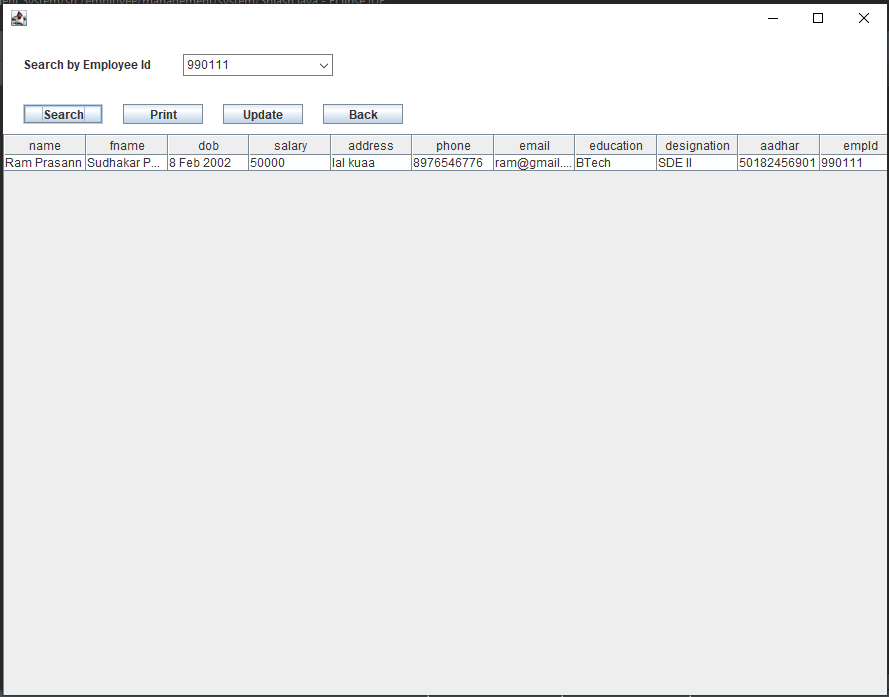
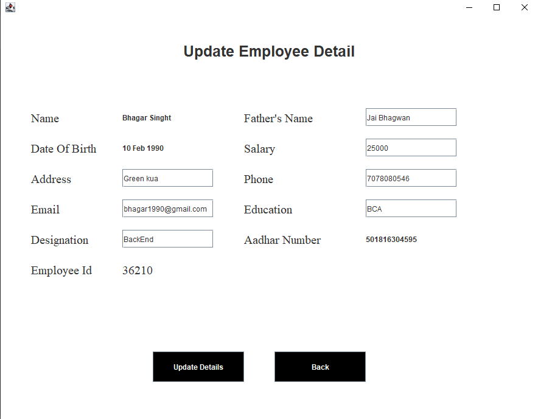
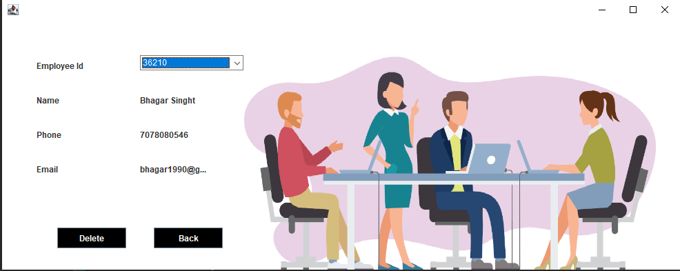

# Employee Management System 🧑‍💼💻

A **Java Swing + JDBC based Employee Management System** designed to manage employee records efficiently through a simple, intuitive, and user-friendly desktop application.

This project demonstrates the practical implementation of **Core Java concepts**, **GUI development using Swing**, and **database connectivity using JDBC with MySQL**.

---

## 🚀 Features

- 🔐 Secure Login System  
- ➕ Add New Employee Records  
- ✏️ Update Existing Employee Details  
- ❌ Remove Employee by ID  
- 👁️ View Employee Information  
- 🔍 Search Employee by Employee ID  
- 🏠 Interactive Home Dashboard  
- 💾 MySQL Database Integration using JDBC  
- 🎨 Clean and user-friendly Swing UI  

---

## 📸 Project Screenshots

### 🔹 Splash / First Screen


### 🔹 Login Screen


### 🔹 Dashboard


### 🔹 Add Employee


### 🔹 View Employee


### 🔹 Search Employee by ID


### 🔹 Update Employee Details


### 🔹 Remove Employee


---

## 🛠️ Technologies Used

- **Java (Core Java)**
- **Java Swing** – Graphical User Interface
- **JDBC** – Database Connectivity
- **MySQL** – Backend Database
- **Git & GitHub** – Version Control System

---

## 📂 Project Structure


```
Employee-Management-System
│
├── src
│   └── employee
│       └── management
│           └── system
│               ├── AddEmployee.java
│               ├── RemoveEmployee.java
│               ├── UpdateEmployee.java
│               ├── ViewEmployee.java
│               ├── Login.java
│               ├── Home.java
│               ├── Splash.java
│               └── Conn.java
│
├── icons
│
├── .gitignore
└── README.md
```

## 🧩 Database Configuration

Update database credentials inside **Conn.java**:

```java
String url = "jdbc:mysql://localhost:3306/employeemanagement";
String username = "root";
String password = "your_password";
```

Make sure:

MySQL Server is running
Database employeemanagement is created


▶️ How to Run the Project

1. Clone the repository:
```java
git clone https://github.com/RamanVerma02/Employee-Management-System.git
```
2. Open the project in Eclipse / IntelliJ IDEA / VS Code
3. Add MySQL JDBC Driver (mysql-connector-j.jar) to the project
4. Configure database details in Conn.java
5. Run Splash.java or Login.java

## 📌 Future Enhancements

- 🔐 Role-based Authentication (Admin / User)
- 📊 Employee Reports Generation
- 🌐 Web Version using Spring Boot
- 🔑 JWT-based Authentication
- 📱 Modern UI Upgrade

---

## 👨‍💻 Author

**Raman Verma**  
🎓 MCA Student  
💻 Aspiring Full Stack Developer  

🔗 GitHub: https://github.com/RamanVerma02

---

## ⭐ Support

If you like this project, please consider giving it a ⭐ on GitHub.  
Your support motivates me to build more projects!

